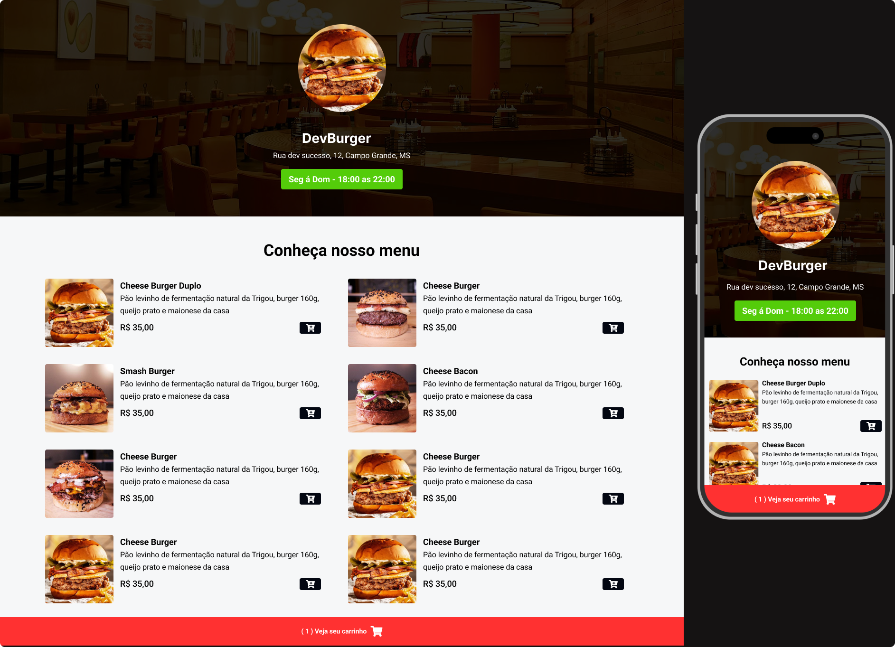

<h1 align="center">
  DevBurger
</h1>

  

## 💻 Projeto

 Projeto Cardápio Hamburgueria  para fazer pedido via WhatsApp.
  **DevBurger** ao usar _HTML_ , _CSS_ , _JAVASCRIPT_ , _TAILWIND.CSS_. e _NODE.JS_

## 🚀 Tecnologias

- HTML
- CSS
- JAVASCRIPT
- TAILWIND.CSS
-NODE.JS

## 📔 Conhecimentos abordados

- [x] Uso do HTML
- [x] CSS
- [x] TAILWIND.CSS Framework CSS
- [x] NODE.JS Modules
- [x] API WhatsApp

